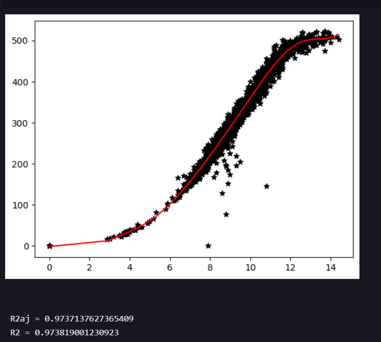

## Regressão Multipla ##
        A regressão múltipla tem como objetivo resolver problemas de regressão na qual envolve múltiplas
        variáveis regressoras,onde, no geral, a variável de saída ou resposta, Y, pode ser relacionada
        a K variáveis de entrada. Descrevendo assim, um hiperplano no espaço.
        
        Modelos de regressão linear múltipla são usados, em geral, como funções aproximadoras ou inter-
        poladoras. Ou seja, a verdadeira relação funcional entre Y e X1,X2, ... Xn é desconhecida, mas
        mas dentro de certos intervalos das variáveis de entrada o modelo de regressão linear é uma
        aproximação adequada.
        
$y = \beta_0 + \beta_1x_1 + ... + \beta_nx_n + \epsilon$

Obs: $\epsilon$ é ruído ou erro, tem média 0 e variância $\sigma_\epsilon^2$.
## Dos dados do Aerogerador ##
        O arquivo aerogerador.dat conta com 2 colunas, a primeira contendo os valores de velocidade do
        aerogerador e a segunda coluna contendo as respectivas potências geradas por essa velocidade.

## Dos Resultados ##
    Os pontos pretos são os dados do aerogerador, Velocidade X Potência, a reta vermelha representa a
    função regressora, servindo como um aproximador preciso. No caso do código foi utilizado 10 variá-
    veis regressoras, sendo X1 as variáveis de entrada e X2,X3,...,X10 as variáveis X1^2,^3, ... ^10.
    Dos resultados das precisões obtidos foram:
$R^2 = 0.9736$  é o Coeficiente de Determinação
$R_(aj)^2 = 0.9735$ é o Coeficiente de Determinação Ajustado.
    Determinando um modelo bem representativo dos dados.

